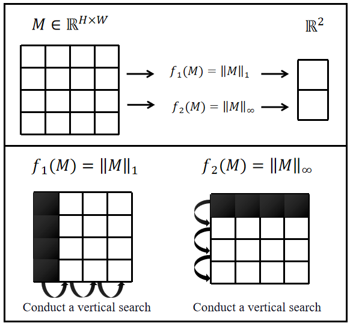

# HV-CA: Horizontal and Vertical Pooling Channel Attention

Official PyTorch implementation of **HV-CA: A Plug-and-Play Channel Attention Driven by Horizontal and Vertical Pooling for Convolutional Neural Networks** (Zhu et al.).  
This repository contains the code for the HV-Pooling module and its integration into popular CNN architectures (ResNet, Inception, SwinUnet) for image classification and segmentation.

---

## 📖 Overview

Channel attention mechanisms typically use **global average pooling (GAP)** to squeeze feature maps into a single statistic. However, GAP discards spatial structure and dilutes salient information, especially in sparse feature maps common in deep CNNs.  
**HV-CA** replaces GAP with **Horizontal and Vertical Pooling (HV-Pooling)**, which extracts the most significant row and column features using induced matrix norms. This preserves both magnitude and positional cues, leading to more accurate channel weights.

### 🔬 Method: Horizontal and Vertical Pooling (HV-Pooling)

For a feature map $U \in \mathbb{R}^{H \times W}$, the traditional global average pooling will map it into a statistic $z$:

$$z = \frac{1}{H \times W} \sum_{i=1}^{H} \sum_{j=1}^{W} u_{ij}$$

Here, $u_{ij}$ represents the element in the $i$-th row and $j$-th column. We argue that features obtained through global average pooling struggle to fully capture the significance of a feature map. First, global average pooling lacks positional awareness. Each element $u_{ij}$ contributes equally to the computed statistic $z$, disregarding spatial importance. In contrast, max pooling considers only the most dominant element, preserving its location. Additionally, feature maps are often sparse matrices, meaning most elements $u_{ij}$ are zero. As a result, only a small subset of elements significantly contribute to $z$, while the scaling factor $\frac{1}{H \times W}$ further suppresses these values, weakening their impact.

To address these limitations, we propose **Horizontal and Vertical Pooling (HV-Pooling)** as an alternative to global average pooling. This method enhances the model's ability to capture deep feature information. The pooling formulation is summarized as follows:

$$\left[\begin{array}{c} z_1 \\ z_2 \end{array}\right] = \left[\begin{array}{c} \|U\|_1 \\ \|U\|_\infty \end{array}\right] = \left[\begin{array}{c} \max_j \sum_i |u_{ij}| \\ \max_i \sum_j |u_{ij}| \end{array}\right]$$

We obtain a statistical vector $\mathbf{z} \in \mathbb{R}^2$, where the first element represents the maximum row feature of the corresponding matrix, and the second element represents the maximum column feature of the corresponding matrix. Therefore, the resulting statistical vector preserves important information and includes positional details.

Due to the nature of the ReLU activation function, all elements in the feature maps are non-negative. Therefore, the absolute value operation in the L₁ norm becomes redundant, i.e., $|u_{ij}| = u_{ij}$. This simplification eliminates the need for absolute value calculations, although the $\max$ operation remains sub-differentiable. In practice, subgradients can be used during backpropagation, making the overall pooling operation effectively differentiable. We can simplify the operation as:

$$\left[\begin{array}{c} \max_j \sum_i |u_{ij}| \\ \max_i \sum_j |u_{ij}| \end{array}\right] = \left[\begin{array}{c} \max_j \sum_i u_{ij} \\ \max_i \sum_j u_{ij} \end{array}\right]$$

- $z_1$ : **maximum column sum** – captures the strongest vertical strip (induced $L_1$ norm)
- $z_2$ : **maximum row sum** – captures the strongest horizontal strip (induced $L_\infty$ norm)

These two values form a compact 2-dimensional descriptor that retains the most energetic rows and columns, preserving both **intensity** and **spatial sensitivity**.

The figure below illustrates the HV-Pooling operation:

  
  
<em>Our horizontal and vertical pooling method operates on a feature map denoted as <i>M</i>. The functions <i>f1</i> and <i>f2</i> serve as mappings that reduce the matrix to statistical quantities. Specifically, <i>f1</i> extracts the maximum feature from each column, while <i>f2</i> extracts the maximum feature from each row.</em>

---

## 🛠️ Environment & Requirements

Experiments were conducted on the following setup:

| Component | Specification |
|-----------|---------------|
| **OS** | Ubuntu 18.04 |
| **GPU** | NVIDIA GeForce RTX 3090 (24GB VRAM) |
| **CUDA** | 11.0 (compatible with PyTorch 1.7) |
| **Python** | 3.8 |
| **PyTorch** | 1.7 |

---
